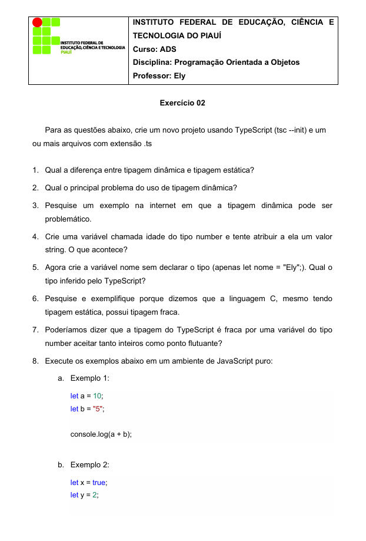
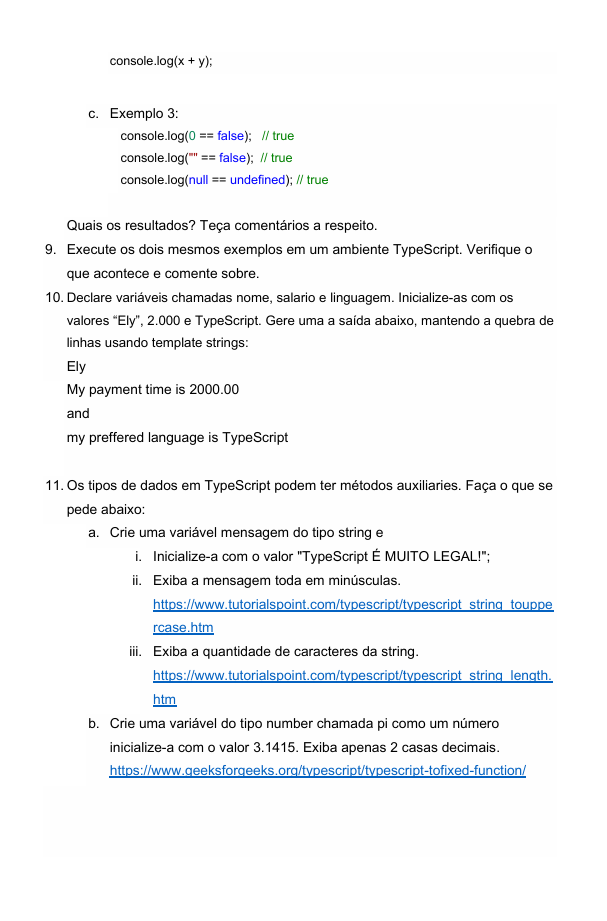
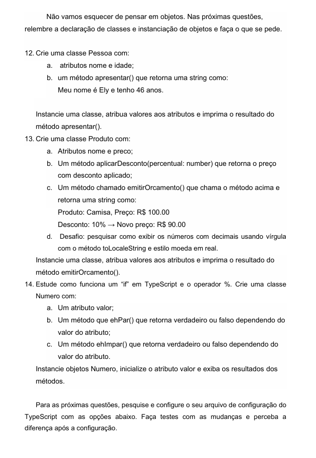
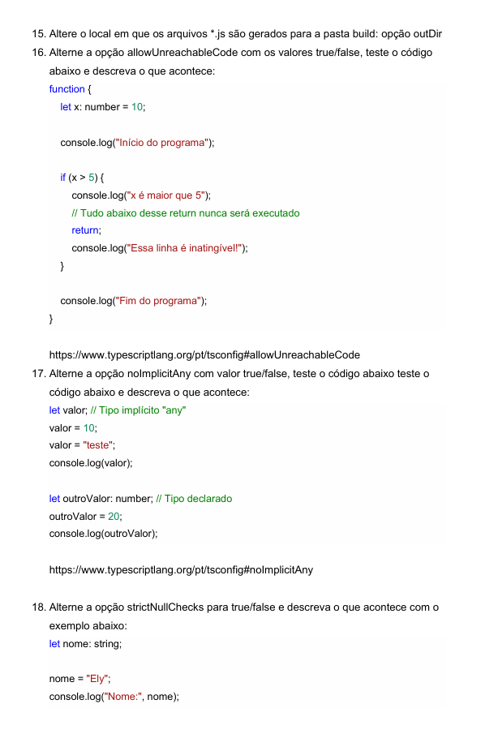

# POO - Atividade 02: Fundamentos de TypeScript

Este repositório contém a resolução da lista de exercícios 02, da disciplina de Programação Orientada a Objetos, focada nos conceitos fundamentais da linguagem TypeScript.

---

## 📝 Enunciado dos Exercícios

Abaixo estão as imagens do arquivo PDF com a lista de questões da atividade.

### Página 1

### Página 2

### Página 3

### Página 4

### Página 5

